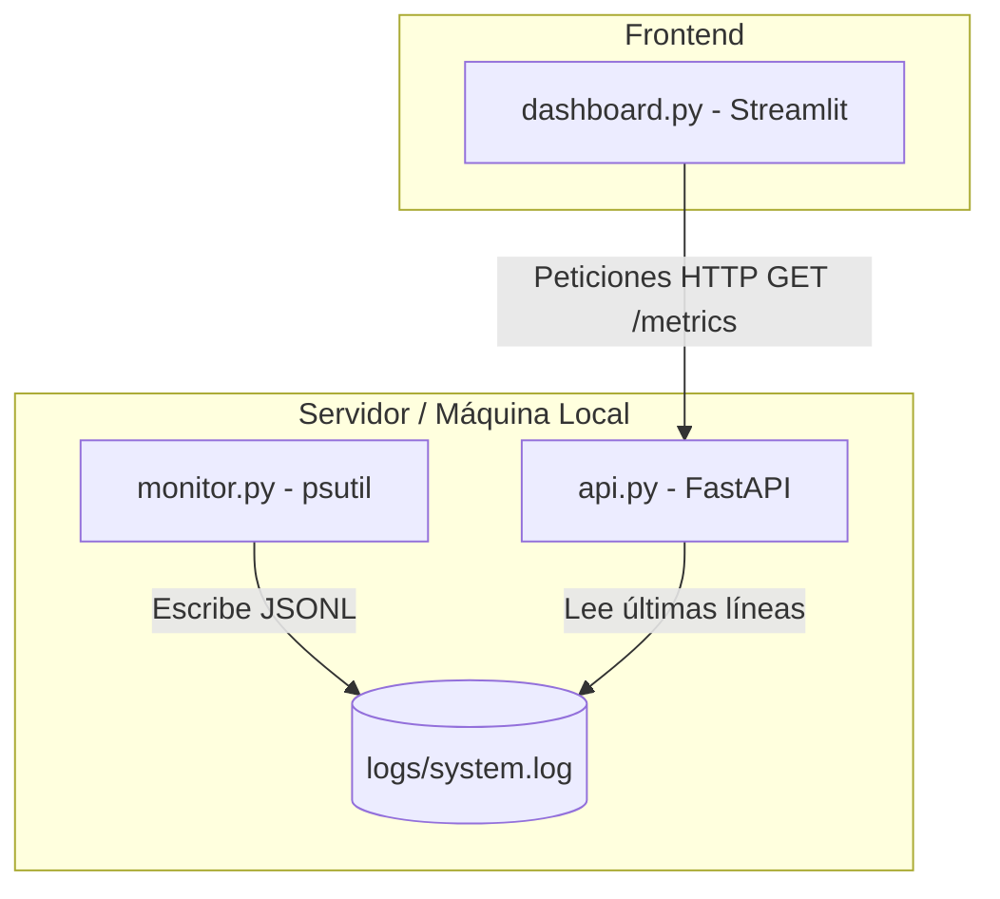

# 🖥️ System Monitor CLI & Dashboard

Una plataforma ligera e interactiva de monitorización de rendimiento del sistema en tiempo real. Este proyecto ha sido desarrollado como una base práctica para aprender **Linux, Observabilidad, APIs de alto rendimiento y DevOps**.

El sistema se divide en tres componentes desacoplados que interactúan de forma asíncrona a través de logs estructurados:

1. **El Recolector (`monitor.py`)**: Script en segundo plano que recopila métricas de CPU, RAM, disco, red y procesos, guardándolas como JSON estructurado (JSONL).
2. **La API (`api.py`)**: Backend construido con **FastAPI** que lee eficientemente los logs más recientes y los expone a través de un endpoint HTTP REST.
3. **El Dashboard (`dashboard.py`)**: Interfaz web interactiva construida con **Streamlit** que consume la API y muestra gráficos históricos e indicadores en tiempo real con refresco automático optimizado.

---

## 📐 Arquitectura del Sistema



---

## 🛠️ Requisitos Previos

* Python 3.10 o superior.
* Sistema operativo basado en UNIX (Linux, macOS) recomendado.

---

## 🚀 Instalación y Configuración Rápida

El proyecto incluye un `Makefile` y un script automatizado para facilitar su inicialización y gestión local.

### 1. Clonar el repositorio y entrar al proyecto
```bash
git clone https://github.com/gtrujillovdev-cyber/DevOps.git
cd DevOps/system-monitor-cli
```

### 2. Crear el entorno virtual e instalar dependencias
Puedes usar el `Makefile` para instalar todo rápidamente:
```bash
make install
```
*(Alternativa manual: `python3 -m venv .venv && source .venv/bin/activate && pip install -r requirements.txt`)*

---

## 💻 Ejecución del Proyecto

### Desarrollo en Local (Un solo comando)
Para levantar los tres servicios de forma simultánea y en segundo plano sin ocupar múltiples terminales:
```bash
make dev
```
*(O ejecuta directamente `./start.sh`)*

Para apagar de forma limpia todos los servicios de fondo, pulsa **`Ctrl + C`** en la terminal. El script matará los procesos asociados para liberar los puertos.

### Comandos de Limpieza
Si deseas borrar los archivos temporales de Python y los logs generados por el sistema:
```bash
make clean
```

---

## 🌐 Endpoints y Puertos Locales

* **FastAPI Backend (API):** `http://127.0.0.1:8000/metrics`
* **Streamlit Dashboard (UI):** `http://localhost:8501`

---

## 📁 Estructura del Proyecto

* `monitor.py` - Recolecta métricas de hardware mediante `psutil`.
* `api.py` - Endpoint `/metrics` con FastAPI.
* `dashboard.py` - UI en tiempo real con Streamlit.
* `start.sh` - Automatización multiproceso y manejo de señales (`trap`).
* `Makefile` - Atajos de terminal para desarrollo.
* `.gitignore` - Excluye archivos locales del control de versiones.
* `logs/` - Directorio reservado para los archivos de logs.

---

## 🧠 Buenas Prácticas de Ingeniería Aplicadas

* **Acoplamiento Débil (Decoupling):** El recolector y la API no se comunican directamente; comparten un almacenamiento de datos persistente (`system.log`). Si la API se detiene, el recolector sigue funcionando sin interrupciones.
* **Auto-refresco Eficiente:** Streamlit utiliza `@st.fragment` para actualizar solo los componentes visuales del dashboard cada 3 segundos, evitando recargas completas de página que sobrecargan el navegador.
* **Gestión de Señales UNIX:** El script de inicio utiliza el comando `trap` para capturar la señal `SIGINT` (Ctrl+C) y garantizar que los servicios en segundo plano se detengan limpiamente, liberando los puertos 8000 y 8501.
